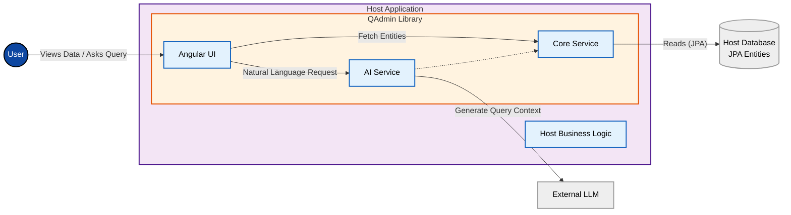

# QAdmin

A plug-and-play Java library built with the Quarkus framework,
enabling entity data management through an Angular-based graphical user interface.

## Key features
- **Automatic Entity Detection**: Seamlessly scans and identifies JPA entities within your application.
- **Graphical User Interface**: Provides an Angular-based UI for data display.
- **CRUD Operations**: (Planned) Modify entities without writing dedicated REST endpoints.
- **Natural Language Querying**: (Planned) Enables users to query and manipulate entity data using natural language, powered by AI integration.

## Usage
Build using `mvn clean install` and add QAdmin as a dependency to your project:

```xml
<dependency>
    <groupId>pl.maliniak</groupId>
    <artifactId>qadmin</artifactId>
    <version>1.0.0-SNAPSHOT</version>
</dependency>
```

UI is available by default under:
```
http://localhost:8080/qadmin
```


## Architecture

Below is a high-level architecture diagram illustrating how qadmin integrates with a host application.

Note: AI component not yet integrated. WIP


## Development Workflow

For the best developer experience with instant hot-reloads across the entire stack, use two separate terminal windows:

### 1. Backend (Quarkus Dev Mode)
From the root directory, run:
```bash
mvn -pl sample-app quarkus:dev -am
```
*Note: Hot-reload for the extension is enabled via the `<quarkus.extension.working-directory>true</quarkus.extension.working-directory>` property in `sample-app/pom.xml`.*

### 2. Frontend (Angular Dev Server)
From the `webui` directory, run:
```bash
npm start
```
*This starts the Angular dev server on `http://localhost:4200` with Hot Module Replacement (HMR). API calls to `/q/qadmin/api` are seamlessly proxied to your Quarkus dev server on port `8080`.*